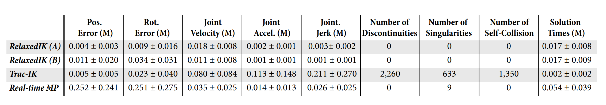

# RelaxedIK: Real-time Synthesis of Accurate and Feasible Robot Arm Motion 

Daniel Rakita, Bilge Mutlu, Michael Gleicher Department of Computer Sciences, University of Wisconsin-Madison \{rakita,bilge,gleicher\}@cs.wisc.edu

#### Abstract

We present a real-time motion-synthesis method for robot manipulators, called RelaxedIK, that is able to not only accurately match end-effector pose goals as done by traditional IK solvers, but also create smooth, feasible motions that avoid jointspace discontinuities, self-collisions, and kinematic singularities. To achieve these objectives on-the-fly, we cast the standard IK formulation as a weighted-sum non-linear optimization problem, such that motion goals in addition to end-effector pose matching can be encoded as terms in the sum. We present a normalization procedure such that our method is able to effectively make tradeoffs to simultaneously reconcile many, and potentially competing, objectives. Using these trade-offs, our formulation allows features to be relaxed when in conflict with other features deemed more important at a given time. We compare performance against a state-of-the-art IK solver and a real-time motionplanning approach in several geometric and real-world tasks on seven robot platforms ranging from 5-DOF to 8-DOF. We show that our method achieves motions that effectively follow position and orientation end-effector goals without sacrificing motion feasibility, resulting in more successful execution of tasks compared to the baseline approaches.

## I. INTRODUCTION

To perform real-time tasks, a robotic manipulator must calculate how its joint angles should change at each update in order to meet kinematic goals rooted in its environment. For instance, a robot providing home-care assistance by spoonfeeding an individual in a wheelchair would have to make realtime motion decisions to simultaneously meet many objectives, including the robot manipulator approaching the patient's head with smooth, self-collision-free motions, continuously updating the position and orientation of the spoon to account for potential head or torso motion, and keeping the spoon level such that the food does not spill. In this problem, and many other use cases for robotics, the robot must both accurately match end-effector pose goals and exhibit motion feasibility.

Prior approaches to matching end-effector goals while producing feasible motion provide only partial solutions. For instance, direct point-to-point methods provide accurate endeffector pose matching by solving inverse kinematics (IK) problems at each update. However, this approach does not guarantee feasible motion when generating a sequence of solutions and may result in behaviors such as exhibiting instantaneous jumps in joint space, causing damage to the robot through self collisions, and exhibiting unsafe behavior near kinematic singularities. Conversely, real-time motionplanning methods that calculate a path to predicted state as quickly as possible, do guarantee motion feasibility, but they

Fig. 1. In this paper, we present a method for generating accurate and feasible robot arm motions in real-time such that the arm not only can match endeffector pose goals, but it also avoids self-collisions, singularities, and jointspace discontinuities. This figure illustrates a DRC-Hubo+ robot performing the square-tracing task from our evaluation using RelaxedIK.

do not ensure consistent matching of end-effector pose goals throughout a continuous motion. For instance, if the planner must compute a path between distant start and goal states, i.e., when the IK solver exhibits a discontinuous jump after the prediction step, what the end-effector will do along the path between the Cartesian waypoints can be difficult to dictate.

In this paper, we present a novel real-time motion-synthesis method that simultaneously supports end-effector pose goal
matching and feasibility of motion. We achieve accurate, feasible motion through a generalized IK solver, called RelaxedIK, that formulates the IK problem at each update as a weightedsum non-linear optimization. Each term in the weighted sum encodes a specific motion objective, such as end-effector position/orientation goal matching, minimum-jerk joint motion, distance from self-collision state, etc. While parameter tuning can become unwieldy for multi-objective optimizations, we present a normalization procedure over the weighted sum terms that elicits expected and intuitive motion behavior. Because these objectives may be in conflict during motion, such as the robot trying to match a position goal within the volume of its body, the method automatically relaxes features that are in conflict with other features deemed more important at a given time. Our formulation does not to rely on a specific optimization technique and provides sufficient solutions using many constrained non-linear optimization solvers.

Objective importances are specified through term weights and thus can be tailored to a specific task. Weights can even be dynamically adjusted during runtime to varying effect, such as decreasing relative importance on orientation matching when the robot must follow a fast-moving position goal [18]. Unlike many IK frameworks that achieve secondary goals through regularization techniques [4, 17, 24], our method does not require any redundant joints, and even provides as close as possible results on under-articulated robots.

Our method affords motion features that enable the creation of a sequence of feasible configurations, including minimum velocity, acceleration, and jerk joint motion; self-collision avoidance; and kinematic-singularity avoidance. While these features are more commonly found in offline trajectoryoptimization and motion-planning methods [10, 21, 22], we utilize efficient and robust techniques to achieve real-time performance, such as using a neural network to approximate distance from collision states and singular value decomposition (SVD) to approximate distance to singular configurations.

We show the benefits of our method through various empirical tests that compare performance on several geometric and real-world tasks on seven robot platforms, ranging from 5-DOF to 8-DOF, against a state-of-the-art IK solver [1] and a real-time motion-planning approach using the Open Motion Planning Library (OMPL) [26]. Our method achieves motions that effectively follow position and orientation end-effector goals without sacrificing motion feasibility, leading to more successful execution of tasks than the baseline approaches.

A solver that implements the methods discussed in this work is available for download as open-source software at https://github.com/uwgraphics/relaxed_ik

## II. RELATED WORK

The development of our method for accurate and smooth real-time motion synthesis draws from prior work in robotics, especially from inverse kinematics, teleoperation and controls, trajectory optimization, and motion planning, and from animation for methods that optimize over motions for real-time use.
Inverse Kinematics- The process of calculating joint-angle values on articulated chains that produce desired pose goals of end-effectors, called inverse kinematics (IK), has been extensively studied in robotics and animation (see Buss [3] for a review of IK methods). The main objective of many IK solvers is to reliably match the end-effector goal as quickly as possible. A state-of-the-art solver to achieve these goals on robot chains is the Trac-IK solver proposed by Beeson and Ames [1], which serves as the main comparison in this work.

While 6-DOF chains generally have one solution to fully constrained position and orientation IK problems, prior research has attempted to take advantage of joint redundancy, if present, in order to achieve secondary goals by regularizing solutions-often called task-priority IK [4, 5, 17, 24]. Although we find inspiration in the ability of these general regularization techniques to achieve supplementary objectives, our method does not require any redundancy and can even work on under-articulated robots. Hauser [9] has formulated a framework for regularizing a smooth inverse of a multivariate function, such as a forward-kinematics model, such that the inverse is the same forward and backward along a path and that discontinuity boundaries are avoided as much as possible. This work has been shown to be effective with multiple redundant DOFs, but it has not been used on fully constrained IK problems. We believe that our methods complement the overall framework presented in this prior work.

In animation, work by Shin et al. [23] introduced an IK technique for real-time articulated character puppetry that adjusted objectives on-the-fly depending on what is currently important. Our method is inspired by this idea of importancebased IK, as the terms in our weighted sum are formulated such that their respective motion features automatically relax if another more important term is in conflict.

Teleoperation and Controls-Synthesizing motions on the fly is particularly important in direct and shared control, as the system cannot look ahead to determine what motions will be required in the near future. The approaches described in seminal research, such as potential-field methods that afford real-time collision avoidance [12] and kinematic-singularityrobust damped least-squares methods [5, 15], serve as inspiration for our real-time motion-feasibility techniques. Our prior work has shown the benefits of optimization-based methods for synthesizing motion across various task domains, including a method for real-time human-to-robot motion remapping to support intuitive teleoperation [18], a motion-remapping technique used for motor task training [20], and a real-time motion synthesis method used to drive a robot camera to optimize a viewpoint for a remote teleoperation operator [19].

Real-time Motion Planning-Our work shares parallels with real-time motion planning techniques, which involve planning to predicted end-effector pose goals as fast as possible to meet real-time demands. Hauser [8] provides an adaptive way to adjust the planning horizon time such that prediction and planning steps can be interleaved in a stable manner. Our work shares similar outcomes to this work, such as planning around obstacles in real-time. However, as we show
in this work, controlling the end-effector pose en route to a predicted waypoint using motion-planning methods is difficult and ineffective for certain tasks. Additionally, Murray et al. [16] present a real-time motion-planning approach that can solve for paths very quickly by reasoning about paths at the hardware level using a custom chip. While this approach enables feasible paths through joint space to be found nearly instantaneously, it does not provide solutions that enable the robot to follow precise Cartesian paths as done in our solution. To overcome this problem, Murray et al. [16] used motion planning to find a path that exhibited an end-effector pose at the end point within 10 cm of the goal and then switched over to a Cartesian planner to precisely approach the goal.

## III. TEChnical OVERVIEW

The main goal of our method is to calculate robot motions that match end-effector pose goals while also exhibiting motion feasibility. In this section, we provide a high level idea of how our method is structured to achieve both of these goals, leaving the mathematical treatment of our solutions for $\$ \mathrm{IV}$

## A. Problem Formulation

Our method is rooted as a standard inverse kinematics (IK) problem. At each system update, the method receives a goal position $\mathbf{p}_{g}$ and a goal orientation $\mathbf{q}_{g}$ for the end-effector and outputs joint angles corresponding to a desired robot state.

While standard IK approaches solely focus on matching end-effector pose goals as accurately and quickly as possible, our method also considers robot configuration feasibility upon a sequence of solutions. Throughout this work, we define robot configuration feasibility as meeting the criteria that the robot (1) does not break velocity limits upon consecutive solutions, i.e., the solver does not cause joint space discontinuities, and the output motion upon a sequence of solutions should be continuous; (2) does not collide with itself at any point during run-time to avoid any damage to the robot or errors during performance in critical applications; and (3) does not enter kinematic singularity (when the robot's Jacobian matrix loses full column rank), which can cause dangerous diverging velocities or joint lockups. Given this notion of feasibility, we reformulate the standard IK problem as follows:

Match the end-effector pose goal corresponding to goal position $\mathbf{p}_{g}$ and goal orientation $\mathbf{q}_{g}$ as precisely and quickly as possible without sacrificing robot configuration feasibility.

We expect that solving discrete IK problems at each update with this central goal, each with an individual sense of feasibility, will in turn yield continuous and feasible motions upon a sequence of such solutions. This formulation does not consider end-effector pose matching as a hard constraint; pose goals may instead be relaxed if other, more important features will be met. This is a key insight in our method, as this affords feasible and smooth motions even when such a path does not exist passing through exact IK solutions. It is also this relaxation characteristic that allows our method to work without any joint redundancy, as our method will inherently "regularize" solutions in operational space if deemed necessary, even if a null-space is not present on a 6-DOF (or less) robot.

## B. Importance-Based Inverse Kinematics

Because our method can relax certain features in favor of other features, it must offer intuitive and robust ways to set and tune relative weights between objectives. To achieve this goal, we draw from a concept called importance-based inverse kinematics, a technique pioneered in animation to drive real-time performance capture [23]. Prior work notes the key observation that the main objective in an IK problem can vary across scenarios, such as whether the animated character should match the general arm shape of the actor, e.g., when making a communicative gesture, or match the end-effector pose of the actor in space, e.g., when picking up an object.

Our method provides two ways of setting objective term relative importances: (1) defining static weights for each term prior to run-time that will indicate how important features are relative to each other; and (2) defining dynamic weighting functions for each objective that can adjust relative importances on-the-fly. Dynamically adjusting weights could be useful for certain tasks where relative importances will change at run-time. To illustrate, precise end-effector pose matching would be very important when a sewing robot is threading the needle, but smooth, minimum-jerk joint motion would be more important when the robot is making broad motions to pull the thread through the fabric. In this work, we do not provide examples showing dynamic weighting functions because they are specific to a given task, although they have been shown to be effective in prior work [18, 23].

While tuning an array of parameters can become unwieldy in multi-objective optimizations, we present a normalization procedure, outlined in $I V-A$ that ensures that the method reasons over values in a standard range. This procedure allows the weights described above to elicit expected behavior, making parameter tuning practical over numerous terms.

## C. Optimization Overview

Given the varying objective importances outlined in the previous section, our method needs some way of reconciling many, potentially competing goals of different priorities in real-time. To achieve this, we use a non-linear constrained optimization formulation, which attempts to drive down the objective values of the various objective function terms, subject to a set of constraints.

Put formally, we express the IK problem as follows:

$$
\begin{gather*}
\Theta=\underset{\Theta}{\arg \min } \mathbf{f}(\Theta) \text { s.t. } \mathbf{c}_{i}(\Theta) \geq \mathbf{0}, \quad \mathbf{c}_{e}(\Theta)=\mathbf{0} \\
l_{i} \leq \Theta_{i} \leq u_{i}, \forall i \tag{1}
\end{gather*}
$$

where $\mathbf{c}_{i}(\Theta)$ is a set of inequality constraints, $\mathbf{c}_{e}(\Theta)$ is a set of equality constraints, $l_{i}$ and $u_{i}$ values define the upper and lower bounds for the robot's joints, and $\mathbf{f}$ is an objective function. Our challenge is to encode our motion and feasibility goals within the constraints and objectives.

We express our objective function as a weighted sum of individual goals, such as end-effector position matching, end-
effector orientation matching, minimum jerk joint motion, and distance to singularity, and formalize it as follows:

$$
\begin{equation*}
\mathbf{f}(\Theta)=\sum_{i=1}^{k} w_{i} * h_{i}(\Theta, v(t)) * f_{i}\left(\Theta, \Omega_{i}\right) \tag{2}
\end{equation*}
$$

Here, $w_{i}$ is a static weight value for each term, as described in III-B, which allows the user to incorporate prior knowledge about what terms are most important for a given task. The $h_{i}(\Theta, v(t))$ represents a dynamic weighting function, also outlined in III-B, that can depend on the current robot configuration, $\Theta$, or other time-varying values in the function $v(t)$. Finally, $f_{i}\left(\Theta, \Omega_{i}\right)$ is an objective-term function that encodes a single sub-goal, with $\Omega_{i}$ being model parameters used to construct a particular loss function. The exact structure of the $f_{i}\left(\Theta, \Omega_{i}\right)$ objective functions are covered in $\S$ IV-A

Our full optimization formulation is comprised of seven objective terms and two constraints. The objective terms encode the following kinematic goals: (1) End-effector position matching; (2) end-effector orientation matching; (3) minimized joint velocity; (4) minimized joint acceleration; (5) minimized joint jerk; (6) minimized end-effector translational velocity; (7) and self-collision avoidance. The two constraints are designed to clamp joint velocities at each update and avoid kinematic singularities, respectively. These objectives and constraints are detailed throughout $\$$ IV

## IV. TEChNICAL DetaILS

In this section, we cover the mathematical details that instantiate the high level ideas outlined in $\S$ We first cover the structure of our objective function, then detail the objective terms and constraints that comprise our full optimization.

## A. Objective Function Structure

While a weighted-sum objective function affords expressiveness by encoding each motion goal as a single term in the sum, parameter tuning of the weights can become unwieldy, often leading to unstable or divergent behavior if care is not taken. Parameter tuning would be particularly troublesome in our Cartesian-space motion-synthesis approach, as many objectives may be in conflict at any given time. Ideally, the term weights would correspond to easily explainable behavior, such as a term with weight of two being twice as important as a term with weight of one in the optimization. This behavior is not observed using standard loss functions, such as quadratic, because optimized terms can be over different units at vastly different scales (e.g., joint-space velocities compared to Euclidean distances in operational space).

To facilitate combining objectives, we normalize each term using a parametric normalization function that is designed to scale each function to a uniform range. This function places a narrow "groove" around the goal values, a more gradual falloff away from the groove in order to better integrate with other objectives, and exhibits a consistent gradient that points towards the goal. We implement this normalization function as a Gaussian surrounded by a more gradual polynomial:

Fig. 2. Examples of the loss function used in our weighted-sum objective. Left: Scalar multiplication by a weight fully controls the amplitude of the reward region. Right: The value " $c$ " controls the spread of the reward region.

$$
\begin{align*}
f_{i}\left(\Theta, \Omega_{i}\right) & =(-1)^{n} \exp \left(\frac{-\left(\chi_{i}(\Theta)-s\right)^{2}}{2 c^{2}}\right)  \tag{3}\\
& +r *\left(\chi_{i}(\Theta)-s\right)^{4}
\end{align*}
$$

Here, the scalar values $n, s, c, r$ form the set of model parameters $\Omega$. Together, they shape the loss function to express the needs of a certain term. Here, $n \in\{0,1\}$, which dictates whether the Gaussian is positive or negative. Negative Gaussian regions are areas of high "reward," while the optimization will push away from positive regions of high "cost." The value $s$ shifts the function horizontally, and $c$ adjusts the spread of the Gaussian region. The $r$ value adjusts the transition between the polynomial and Gaussian regions, higher values showing a steeper funneling into the Gaussian region and lower values flattening out the boundaries beyond the Gaussian. The scalar function $\chi(\Theta(t))$ assigns a numerical value to the current robot configuration that will serve as input to the loss function.

In our prototype solver described in $\$ \mathrm{~V}$ all parameter and weight values were selected empirically and were observed to work well in practice; however, using the normalization procedure described in this section, all parameters are robust to tuning for differing results. In the remainder of this section, we will outline the $\chi(\Theta(t))$ functions and model parameters used to formulate our motion-synthesis method.

## B. End-Effector Position Matching

The first term in our weighted sum objective function involves matching up the robot's end effector position to a provided goal position $\mathbf{p}_{g}$. To achieve this goal, we try to minimize the $L 2$ error between the robot's end effector position given the joint configuration $\Theta$ and the goal position $\mathbf{p}_{g}$. Put formally, the objective term is formalized as:

$$
\begin{equation*}
\chi_{p}(\Theta)=\left\|\mathbf{p}_{g}-F K(\Theta)\right\|_{2} \tag{4}
\end{equation*}
$$

Here, $F K(\Theta)$ signifies the end-effector position given joint angles $\Theta$, calculated by the robot's forward kinematics model.

We inject this objective term value $\chi_{p}(\Theta)$ into the parametric loss function described in IV-A using model parameters $n=1, s=0, c=0.2$, and $r=5.0$.

## C. End Effector Orientation Matching

To match the robot's end-effector orientation to a provided goal quaternion $\mathbf{q}_{g}$, we introduce an objective term that will
be minimized as the orientations align. We measure the difference between orientations as the magnitude of the rotation vector between them, $\operatorname{disp}\left(\mathbf{q}_{1}, \mathbf{q}_{2}\right)=\log \left(\mathbf{q}_{1}^{-1} * \mathbf{q}_{2}\right)$ [14]. The objective term is therefore:

$$
\begin{equation*}
\chi_{o}(\Theta)=\operatorname{disp}\left(\mathbf{q}_{g}, \mathbf{q}[\hat{F K}(\Theta)]\right) \tag{5}
\end{equation*}
$$

Here, $\hat{F K}(\Theta)$ specifies the end-effector rotation frame at joint configuration $\Theta$, calculated through the robot's forward kinematics model, and $\mathbf{q}[$.$] indicates a conversion from rotation$ matrix to quaternion.

Two quaternions can specify the same static orientation. This quaternion pair, $\left(i q_{x}+j q_{y}+k q_{z}+q_{w}\right)$ and $\left(-i q_{x}-\right.$ $j q_{y}-k q_{z}-q_{w}$ ), are called anti-podal equivalences. While the two quaternions encode the same orientation, they produce different results when used in the quaternion displacement operator. Thus, in our orientation objective, we check the result of both anti-podal equivalences at each iteration, and we always minimize over the one with smaller displacement to always encourage convergence.

We add this objective term value $\chi_{o}(\Theta)$ into the parametric loss function described in IV-A using model parameters $n=$ $1, s=0, c=0.2$, and $r=5.0$.

## D. Smooth Motion Synthesis

A main goal of our method is to produce smooth joint motion without exhibiting joint-space discontinuities. We achieve this goal using four objective terms and one hard constraint.

The first three smoothness objective terms strive to minimize joint velocity, acceleration, and jerk, respectively:

$$
\begin{equation*}
\chi_{v}(\Theta)=\|\dot{\Theta}\|_{2} ; \chi_{a}(\Theta)=\|\ddot{\Theta}\|_{2} ; \chi_{j}(\Theta)=\|\ddot{\Theta}\|_{2} \tag{6}
\end{equation*}
$$

Velocity, acceleration, and jerk are approximated using backward finite differencing using a window of the past four solutions. Having smooth joint motion up to the third derivative is beneficial in terms of wear and tear on the robot. Prior work also shows this characteristic to be present when people move their arms to complete tasks [6], suggesting that the generated motions may have a more human-like quality.

We also include an objective term that minimizes velocity in the robot's end-effector position space:

$$
\begin{equation*}
\chi_{e}(\Theta)=\|F \dot{K}(\Theta)\|_{2} \tag{7}
\end{equation*}
$$

This term discourages large jumps in operational space, acts as a real-time filter, reduces motion jitters when performing fine-motion tasks, and facilitates motions along straight lines. These four terms all use the same loss function model parameter values $n=1, s=0, c=0.2$, and $r=5.0$.

Lastly, because the aforementioned smoothing terms only encourage motion properties, but do not place any bounds in the case of errors, we include hard inequality constraints on individual joint velocities to further account for failure cases:

$$
\begin{equation*}
\mathbf{c}_{v_{i}}:=\left|\dot{\Theta}_{i}\right| \leq v_{i}, \forall i \in\{1, \ldots, N\} \tag{8}
\end{equation*}
$$

Here, $v_{i}$ refers to the joint-velocity limit for joint $i$ over a single update, and $N$ is the number of robot DOFs.

## E. Self-Collision Avoidance

A key feature of our real-time motion-synthesis method is to provide a way for the robot to avoid any self-collisions, even when using per-frame IK with no look-ahead or prediction. While existing methods can detect when a robot model is colliding with itself, a standard feature within the MoveIt! framework ${ }^{1}$ being alerted of a collision after it happens is not appropriate in real-time motion synthesis. Instead, our method can approximate how imminent the robot is to a collision state and favor configurations that are as far away as possible from self-collision states while still pursuing other goals.

Our approach follows two steps: (1) create a smooth, continuous function that approximates a self-collision cost given a joint state $\Theta$, called $\operatorname{col}(\Theta)$. This is essentially a potential function, congruent with prior collision-avoidance techniques, that is high when near collision and low otherwise [12, 17]; and (2) train a neural network to learn the function from step 1 to speed up the collision approximation process by over two orders of magnitude, making this procedure fast enough to be optimized over in real-time. Our prototype implementation described in $\$ \mathrm{~V}-\mathrm{A}$ uses an approximation of the robot's geometry using line segments. However, the approach extends to other geometric representations, such as capsules or even full mesh models. Initial experiments show that such extensions improve collision avoidance performance.

We start by characterizing the overall geometry of a robot arm by assessing distances between its links in an initial, non-collision state. This allows the method to discern when a collision is likely imminent, as opposed to two links just being naturally close together in a safe state. The method takes as input a sample configuration that is not in self-collision, which we will call $\Theta_{s}$. We calculate the forward kinematics at the $\Theta_{s}$ such that we have all the joint-point positions in the robot's base frame: $\left[j_{1}, j_{2}, \ldots j_{N}\right] \subseteq \mathbb{R}^{3}$. We abstract the full robot geometry by connecting consecutive joint points to make links $\left[l_{1}, l_{2}, \ldots l_{N-1}\right]$, and store the orthogonal distances between all pairs of links $l_{i}$ and $l_{j}$ in a table $d_{i, j}$. Note that $d_{i, j}=0$ when $l_{i}$ and $l_{j}$ are adjacent, or when $i=j$.

Given these initial distances $d_{i, j}$, the method exponentially increases the self-collision cost as distances between links $l_{i}$ and $l_{j}$ are observed to be increasingly less than their standard distance $d_{i, j}$. We use a sum of Gaussian terms to exponentially scale up the cost based on distance between all pairs of links, which are smooth and differentiable when taking gradients for optimization. The function is defined as follows:

$$
\begin{gather*}
\operatorname{col}(\Theta)=\sum_{i, j} b * \exp \left(\frac{-\operatorname{dis}\left(l_{i}, l_{j}\right)^{2}}{2 c^{2}}\right)  \tag{9}\\
c=-d_{i, j}^{2} /\left(2 * \log \left(1^{-50} / b\right)\right)
\end{gather*}
$$

Here, $\operatorname{dis}\left(l_{i}, l_{j}\right)$ signifies the orthogonal distance between links corresponding to the query state $\Theta$. The $b$ value defines the amplitude of the Gaussian and normalizes a total range of return values, and the $c$ value adjusts the spread of the

\footnotetext{
http://moveit.ros.org/

Gaussian such that it starts to trend upwards only when $\operatorname{dis}\left(l_{i}, l_{j}\right)$ is less than its standard distance $d_{i, j}$. When $c=0$, i.e., when $d_{i, j}=0$, the division by zero is manually avoided and nothing is added to the sum. In our prototype solver, we used a value of $b=50$.

The function in Equation 9 checks all combinations of links in approximately 1 ms . While this performance is sufficient for quick checks throughout run-time, it is not fast enough for real-time optimization where the full objective function may be called more than 100 times per solution. To speed up this process, we train a neural network to learn $\operatorname{col}(\Theta)$, which then only requires a simple matrix multiplication for evaluation.

We used a multi-layer perceptron neural network with six hidden layers to learn $\operatorname{col}(\Theta)$. We observed that concatenating the joint points $\left[j_{1}, j_{2}, \ldots j_{N}\right]$ as inputs worked considerably better than naïvely using the robot state $\Theta$. This adds little overhead to the system as the forward kinematics are already being calculated for use by other objective terms. All of the six layers contains $N * 3+5$ nodes, such that each is slightly wider than the input vector. Each node uses a ReLU activation function. We used one million training inputs by randomly generating states, and using outputs of the original $\operatorname{col}(\Theta)$ function. We used the Adam solver to run the network optimization with an adaptive learning rate and a maximum number of three thousand iterations. It takes about fifteen minutes during preprocessing to generate all million input and output pairs, and another twelve minutes to train the network.

Once the neural network is trained, we have a new function col_nn $(\Theta)$ that sufficiently matches the outputs of $\operatorname{col}(\Theta)$ but evaluates a cost in approximately $1 e-05 \mathrm{~s}$. This approximately two orders of magnitude gain in speed over $\operatorname{col}(\Theta)$ enables real-time optimization. Our objective term is formally:

$$
\begin{equation*}
\chi_{c}(\Theta)=c o l \_n n(\Theta) \tag{10}
\end{equation*}
$$

This objective uses loss function model parameter values $n=0, s=0, c=0.08$, and $r=1.0$. Because a neural network is used as a post-process efficiency optimization, the original $\operatorname{col}(\Theta)$ function could be generalized to include distances between full mesh models and could incorporate objects in the environment, which we plan to explore in future our work.

## F. Kinematic Singularity Avoidance

Kinematic singularities are well studied in robotics 77. These objectionable robot poses occur when the Jacobian ma$\operatorname{trix} \mathbf{J}(\Theta)$ that maps joint and end-effector tool velocities, i.e., $\dot{\mathbf{x}}=\mathbf{J}(\Theta) \dot{\Theta}$, loses full column rank. Under these circumstances the chain may lock since an instantaneous change in one of the end-effector DOFs is unattainable. Further, when the Jacobian matrix is near singular, small changes in the endeffector tool space can induce large, diverging velocities in joint angle space, which is unsafe for many applications.

To avoid singular configurations in our motion synthesis method, we use the following approach: (1) find a metric that can approximate distance to a singularity; (2) characterize the robot's general manipulability during preprocessing by analyzing the singularity distance metric in many configurations; and (3) set a hard constraint that avoids configurations deemed to be close to singularities based on the analyses from step 2 .

Because kinematic singularities occur when the Jacobian matrix loses full rank, we use a common metric that approximates distance to such a configuration, called the matrix condition number, which we denote as $c$. This value is found by taking the SVD of the matrix, then taking the ratio of the smallest singular value and the largest singular value: $c=\sigma_{N} / \sigma_{1}$. When this value is small, it indicates that the matrix is not well conditioned, and is close to losing full rank.

Because every robot arm has a distinct geometry and kinematic structure, the distribution of the conditioning number will vary for each arm. This characteristic of a particular robot arm is called its manipulability and is analyzed through a multi-dimensional object called a manipulability ellipse [27]. We chose to analyze the matrix condition number of the Jacobian as a proxy distance to singularity over the Yoshikawa manipulability measure [27], because the condition number favors general roundness of the manipulability ellipse, rather than favoring a larger ellipse as a whole, which generalizes better across different robots [17].

To assess the properties of an arm's manipulability ellipse, we randomly sample 500,000 robot configurations during preprocessing and find the mean, $\mu_{c}$, and standard deviation, $s t d_{c}$, of all condition values $c$. We make the model assumption that the condition-value random variable is approximately normal and set a hard constraint in the optimization such that configurations with condition values less than $\mu_{c}-b * s t d_{c}$ are avoided, for some scalar $b$. In our prototype solver, we used a value of $b=2$, such that approximately the bottom $2.5 \%$ of configurations in terms of condition score will be avoided.

## V. EXPERIMENTAL EVALUATION

In this section, we outline the empirical tests that we carried out to validate our method. Specifically, we describe the prototype solver that instantiated our method, provide detail on our experiments, and finally discuss our findings.

## A. Prototype Details

To demonstrate the effectiveness of our method on various robot platforms and tasks, we implemented a prototype solver that instantiates our real-time motion-synthesis method in Python and pre-compiled performance-critical aspects of the code to $\mathrm{C}++$ using Cython. The solver integrates natively with ROS, enabling real-time monitoring of optimization parameters and constraints, multi-threading, and communication with robot controllers. Our testing was performed on an Intel Xeon W-2145 3.7 GHz CPU with 64 GB RAM.

Because our method requires information about the kinematic structure and geometry of the particular robot arm before run-time, it includes a one-time preprocessing step to gain this information prior to the use of the solver. This step takes as input a robot description in URDF format and initializes various procedures to learn certain geometric and kinematic features about the robot platform. The preprocessing step takes approximately $20-30$ minutes, and the resulting output configuration file can be reused to seed the solver.

## B. Optimization Solver

We aimed for the optimization formulation discussed in this work to be as generalizable as possible and thus not tied to a particular non-linear constrained-optimization algorithm. We evaluated a testbed of thousands of solutions calculated by our method using numerous algorithms, including derivative-based non-linear solvers such as scipy slsqp, NLopt slsqp, NLopt method of moving asymptotes (MMA), NLopt conservative convex separable quadratic approximations (ccsaq) as well as non-derivative-based non-linear solvers such as NLopt BOBYQA (using an augmented Lagrangian method to include the non-linear constraints). All algorithms produced smooth and feasible results and returned solutions fast enough for real-time use. The experiments reported in this paper used the scipy slsqp solver, although our tests suggest that any of the solvers listed above would have been sufficient for use on the full testbed. We supply approximate gradients to the solver using a finite differencing approach.

## C. Experimental Procedure

Our evaluations aimed to compare our method to alternative real-time motion-synthesis approaches with numerous robot platforms and tasks. We designed five tasks, outlined in $\$ \mathrm{~V}$-D. and simulated them on seven robot platforms featuring 5 to 8 DOF arms, including the Fanuc LR Mate 200id ${ }^{2}$ (5-DOF), a Universal Robots UR5 ${ }^{3}$ (6-DOF), a Kinova Jacd ${ }^{4}$ (6-DOF), a Rethink Robotics Sawyet ${ }^{5}$ (7-DOF), a Kuka IIWA $7^{6}$ (7-DOF), a Rainbow Robotics DRC-Hubo+ arm ${ }^{7}$ (7-DOF), and a DRCHubo+ arm-and-waist rotation (8-DOF). We manually selected initial configurations for the robots such that all robots faced the same direction with matching end-effector orientations, and the tasks operated analogously across platforms.

Because real-time motion tasks are very sensitive to an initial configuration, we followed a randomization procedure on initial configurations to account for experimenter bias. For each trial, the system randomly generated a vector shorter than 0.2 m and calculated a random configuration based on this displaced starting position using Trac-IK. The maximum displacement was selected such that the robot always stayed within its manipulation envelope. We did not randomly offset the orientation, because the absolute directions of the endeffector's coordinate frame were often important for a given task. Each task was run with 100 random initial configurations.

Our testbed was run in simulation and consisted of a total of 1,535,500 discrete solutions, including seven robot platforms, five tasks, and 100 random initial configurations. In this paper, we present aggregate results over the entire testbed to give a high-level summary, and detailed statistical results for all individual tasks and robots are provided at: http://graphics.cs.wisc.edu/Robotics/RelaxedIK/Results/

[^0]
## D. Experimental Tasks

Our experimental testbed consisted of five tasks, including three geometric tasks that enabled us to analytically assess the input curve if necessary and two use-case tasks involving a robot home-care assistant. The geometric tasks included circle tracing, square tracing, and isolated rotations. Tracing tasks involved the end-effector following a perfect a circle or a square centered at the robot's base and scaled for each robot to span close to the robot's whole workspace range. The IK goal did not ease in and out at the square's corner, instead following a constant velocity even at the sharp corners. For the tracing tasks, the robot's end-effector remained static in its initial orientation. Isolated rotations involved the robot's endeffector rotating 180-degrees and back around yaw, pitch, and roll axes. No end-effector translation was present for this task. The two home-care-scenario tasks were spoon feeding and cooking. Spoon feeding involved the robot arm using a spoon to retrieve food from bowls placed around the workspace using a spoon and to offer the food to an individual in a wheelchair for feeding. Cooking was a two-arm task involving moving a pot from the stove top to the counter. Because the two arms have to coordinate, end-effector configurations and motion feasibility are both of particular importance, as highlighted in previous work [25]. For the home-care tasks, the end-effector traces were hand animated in a 3D-animation tool at 50 Hz .

## E. Comparisons

We compared RelaxedIK against two alternative real-time motion-synthesis approaches. The first comparison is a direct point-to-point approach that uses a state-of-the-art IK solver, Trac-IK [1], to perform per-update IK on the given endeffector pose goal. Trac-IK is an slsqp optimization-based IK formulation that minimizes the distance between the given pose goal and the pose of the end-effector, structured as a displacement of dual-quaternions. This formulation also minimizes velocity from a seed state to an optimized state. We seed Trac-IK with the configuration from the previous update. Our tests used the open-source C++ Trac-IK library [1].

Our second comparison was real-time motion planning, which predicts what pose the end-effector should have in the future, calculates a goal state corresponding to the predicted pose using an IK solver, plans a feasible motion from the current state to the goal state, and finally executes the trajectory along this planned path [8]. The planning and execution phases proceed as fast as possible to meet real-time demands. Our testing used the open-source OMPL [26] motion planners that are integrated within the MoveIt! ROS package.

Our implementation used Trac-IK, as incorporated into MoveIt!, as the IK solver after the prediction step. We allow the IK solver to have perfect pose prediction up to $0.2 s$ ahead at the prediction step to prevent negative results due to poor prediction or an inadequate planning horizon to be able to observe real-time motion planning under ideal conditions.

For the motion-planning phase, we first use an RRT-Connect planner [13] and then a PRM planner[11] as backup if the first

Fig. 3. Summary of aggregated results from our experiments.

planner failed to find a path. Because state-of-the-art techniques, such as parallelization using GPUs [2] and hardwarelevel planning using custom chips [16], allow real-time use of motion planning, we also provide motion planners with as much time as they needed to converge, even when tracking the real-time goal in the testbed. We report solution times based on the implementation described above, although we make the assumption that these real-time approaches could keep up with such goals given their reported timing information.

We tested RelaxedIK with two different importance weight configurations. In RelaxedIK (A), the configuration emphasized end-effector accuracy with the following weights: $\left\{w_{p}=\right.$ $\left.50, w_{o}=40, w_{v}=0.1, w_{a}=1, w_{j}=2, w_{e}=0.1, w_{c}=2\right\}$. The configuration in RelaxedIK ( $B$ ) emphasized smoothness and feasibility with the following weights: $\left\{w_{p}=10, w_{o}=\right.$ $\left.9, w_{v}=5, w_{a}=4, w_{j}=3, w_{e}=2, w_{c}=5\right\}$

## F. Measures

We assessed eight objective measures to compare the three real-time motion synthesis methods in our evaluation: mean position error (meters), mean rotational error (radians), mean joint velocity $(\mathrm{rad} / \mathrm{s})$, mean joint acceleration $\left(\mathrm{rad} / \mathrm{s}^{2}\right)$, mean joint jerk $\left(\mathrm{rad} / \mathrm{s}^{3}\right)$, total number of joint discontinuities, total number of singularities, and total number of self-collisions.

## G. Results

Our results are summarized in Figure 3. RelaxedIK (A) was shown to have higher end-effector accuracy than all other comparisons. RelaxedIK ( $B$ ) did show some motion smoothness benefits, as seen by having lower joint velocity, acceleration, and jerk results than all other comparisons; however, these benefits come at the cost of inducing more endeffector position and rotation errors than RelaxedIK (A). Both instantiations of RelaxedIK exhibited feasible motions on all solutions, without exhibiting any discontinuities, singularities, or self-collisions. In contrast, direct point-to-point using Trac$I K$ encountered many of these errors, which would result in infeasible motions when run on a robot platform.

At a high level, real-time motion planning exhibited consistent motion feasibility, showing no joint discontinuities, but did not reliably get close to end-effector position and rotation goals. These errors followed one of two patterns: (1) when the motion planner had to interpolate a long path due to a discontinuity, the end-effector had to deviate from the path to reach the goal state; and (2) when the motion planner failed to find a path, the robot stayed at its previous state, causing significant end-effector pose-matching errors. In contrast,
RelaxedIK showed the same level of motion feasibility while reliably matching end-effector poses throughout the tasks.

Our method takes on average 17 ms to find a solution. Although Trac-IK provided a solution in 2 ms on average in our testing, in many scenarios, the feasibility benefits provided by our method may outweigh the cost of the extra computation time. Our results also indicate that the joint motion generated by RelaxedIK is considerably smoother than direct pointto-point and real-time motion planning, demonstrating the feasibility of real-time minimum-jerk plans discussed in $\S$

## VI. GENERAL DISCUSSION

In this paper, we presented a real-time motion-synthesis method for robot manipulators to reliably match end-effector pose goals while considering motion feasibility objectives onthe-fly. We showed through many empirical tests that our method performs more favorably than state-of-the-art baselines including direct Trac-IK or real-time motion planning on numerous tasks and robot platforms.

Limitations-Our method has a number of limitations that suggest many extensions. First, because we rely on a general constrained non-linear optimization formulation, we cannot provide proofs that our method will always converge and lead to desirable results. We instead provide substantial empirical evidence of the robustness of our method in practice. Additionally, certain guarantees can be achieved by integrating our method as the IK solver in an overall real-time motionplanning framework, thus falling back on the completeness and feasibility guarantees of the motion planner as a backup.

While the overall framework presented in this paper may generalize to consider dynamics objectives and constraints, we have not yet explored this possibility and plan to consider dynamics, particularly how exerted forces and moments could fit into our relaxation framework, in our future work. Lastly, while our method is sufficiently fast for real-time use, it is slower than standard IK solvers. Although the feasibility benefits may outweigh the cost of the additional computation time in many scenarios, we plan to explore ways of speeding up our method so that it can generalize to more domains and more easily work as a subroutine within larger frameworks.

## VII. AcKNOWLEDGEMENTS

This research was supported by the National Science Foundation under award 1208632 and the University of WisconsinMadison Office of the Vice Chancellor for Research and Graduate Education with funding from the Wisconsin Alumni Research Foundation.

## REFERENCES

[1] Patrick Beeson and Barrett Ames. TRAC-IK: An opensource library for improved solving of generic inverse kinematics. In 2015 IEEE-RAS 15th International Conference on Humanoid Robots (Humanoids), pages 928935. IEEE, 2015.

[2] Joshua Bialkowski, Sertac Karaman, and Emilio Frazzoli. Massively parallelizing the RRT and the RRT. In 2011 IEEE/RSJ International Conference on Intelligent Robots and Systems (IROS), pages 3513-3518. IEEE, 2011.

[3] Samuel R Buss. Introduction to inverse kinematics with jacobian transpose, pseudoinverse and damped least squares methods. IEEE Journal of Robotics and Automation, 17(1-19):16, 2004.

[4] Pasquale Chiacchio, Stefano Chiaverini, Lorenzo Sciavicco, and Bruno Siciliano. Closed-loop inverse kinematics schemes for constrained redundant manipulators with task space augmentation and task priority strategy. The International Journal of Robotics Research, 10(4):410425, 1991

[5] Stefano Chiaverini. Singularity-robust task-priority redundancy resolution for real-time kinematic control of robot manipulators. IEEE Transactions on Robotics and Automation, 13(3):398-410, 1997.

[6] Tamar Flash and Neville Hogan. The coordination of arm movements: an experimentally confirmed mathematical model. Journal of neuroscience, 5(7):1688-1703, 1985.

[7] Clement Gosselin and Jorge Angeles. Singularity analysis of closed-loop kinematic chains. IEEE Transactions on Robotics and Automation, 6(3):281-290, 1990.

[8] Kris Hauser. On responsiveness, safety, and completeness in real-time motion planning. Autonomous Robots, 32(1): 35-48, 2012.

[9] Kris Hauser. Continuous pseudoinversion of a multivariate function: Application to global redundancy resolution. In 12th International Workshop on the Algorithmic Foundations of Robotics, 2016.

[10] Mrinal Kalakrishnan, Sachin Chitta, Evangelos Theodorou, Peter Pastor, and Stefan Schaal. STOMP: Stochastic trajectory optimization for motion planning. In 2011 IEEE International Conference on Robotics and Automation (ICRA), pages 4569-4574. IEEE, 2011.

[11] Lydia E Kavraki, Petr Svestka, J-C Latombe, and Mark H Overmars. Probabilistic roadmaps for path planning in high-dimensional configuration spaces. IEEE transactions on Robotics and Automation, 12(4):566-580, 1996.

[12] Oussama Khatib. Real-time obstacle avoidance for manipulators and mobile robots. The international journal of robotics research, 5(1):90-98, 1986.

[13] James J Kuffner and Steven M LaValle. RRT-connect: An efficient approach to single-query path planning. In 2000 IEEE International Conference on Robotics and Automation (ICRA), volume 2, pages 995-1001. IEEE, 2000.
[14] Jehee Lee. Representing rotations and orientations in geometric computing. IEEE Computer Graphics and Applications, 28(2):75-83, 2008.

[15] Anthony A Maciejewski. Dealing with the ill-conditioned equations of motion for articulated figures. IEEE Computer Graphics and Applications, 10(3):63-71, 1990.

[16] Sean Murray, Will Floyd-Jones, Ying Qi, Daniel J Sorin, and George Konidaris. Robot motion planning on a chip. In Robotics: Science and Systems, 2016.

[17] Yoshihiko Nakamura. Advanced robotics: redundancy and optimization. Addison-Wesley Longman Publishing Co., Inc., 1990.

[18] Daniel Rakita, Bilge Mutlu, and Michael Gleicher. A motion retargeting method for effective mimicry-based teleoperation of robot arms. In Proceedings of the 2017 ACM/IEEE International Conference on Human-Robot Interaction, pages 361-370. ACM, 2017.

[19] Daniel Rakita, Bilge Mutlu, and Michael Gleicher. An autonomous dynamic camera method for effective remote teleoperation. In Proceedings of the 2018 ACM/IEEE International Conference on Human-Robot Interaction. ACM, 2018.

[20] Daniel Rakita, Bilge Mutlu, Michael Gleicher, and Laura M. Hiatt. Shared dynamic curves: A sharedcontrol telemanipulation method for motor task training. In Proceedings of the 2018 ACM/IEEE International Conference on Human-Robot Interaction. ACM, 2018.

[21] Nathan Ratliff, Matt Zucker, J Andrew Bagnell, and Siddhartha Srinivasa. CHOMP: Gradient optimization techniques for efficient motion planning. In 2009 IEEE International Conference on Robotics and Automation (ICRA), pages 489-494. IEEE, 2009.

[22] John Schulman, Yan Duan, Jonathan Ho, Alex Lee, Ibrahim Awwal, Henry Bradlow, Jia Pan, Sachin Patil, Ken Goldberg, and Pieter Abbeel. Motion planning with sequential convex optimization and convex collision checking. The International Journal of Robotics Research, 33(9):1251-1270, 2014.

[23] Hyun Joon Shin, Jehee Lee, Sung Yong Shin, and Michael Gleicher. Computer puppetry: An importancebased approach. ACM Transactions on Graphics (TOG), 20(2):67-94, 2001.

[24] Bruno Siciliano. Kinematic control of redundant robot manipulators: A tutorial. Journal of Intelligent \& Robotic Systems, 3(3):201-212, 1990.

[25] Seyed Sina Mirrazavi Salehian, Nadia Figueroa, and Aude Billard. Coordinated multi-arm motion planning: Reaching for moving objects in the face of uncertainty. In Proceedings of Robotics: Science and Systems, 2016.

[26] Ioan A Sucan, Mark Moll, and Lydia E Kavraki. The open motion planning library. IEEE Robotics \& Automation Magazine, 19(4):72-82, 2012.

[27] Tsuneo Yoshikawa. Manipulability of robotic mechanisms. The International Journal of Robotics Research, $4(2): 3-9,1985$.

[^0]:    ${ }^{2}$ http://www.fanuc.eu/se/en/robots/robot-filter-page/lrmate-series

    $3 \sqrt[3]{ }$ https://www.universal-robots.com/products/ur5-robot/

    4 http://www.kinovarobotics.com/innovation-robotics/products/robot-arms/ 5 http://www.rethinkrobotics.com/sawyer/

    6 https://www.kuka.com/en-us/products/robotics-systems/lbr-iiwa 7 http://www.rainbow-robotics.com/products_humanoid

